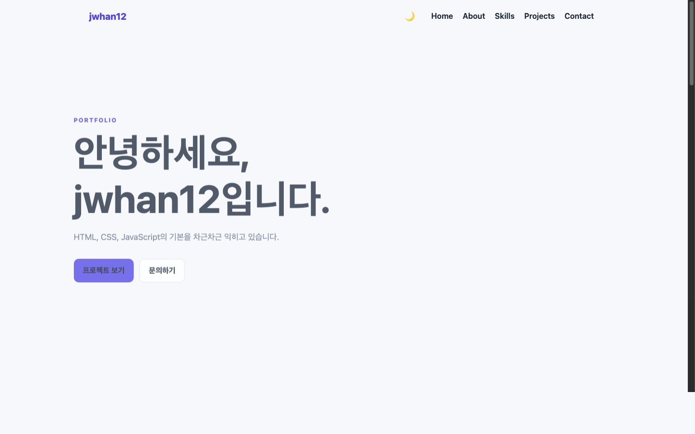
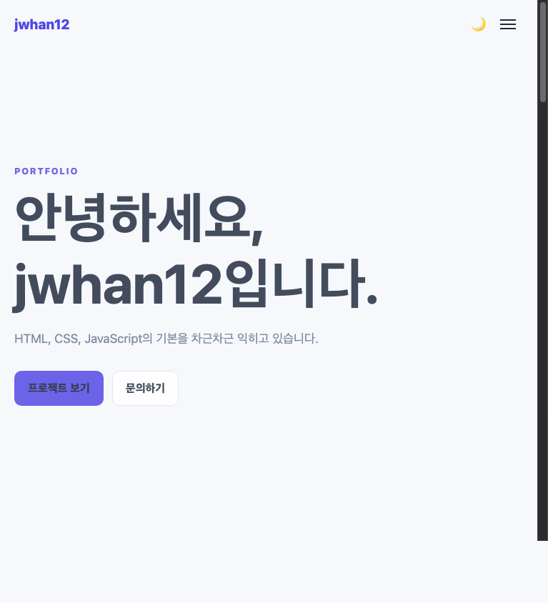
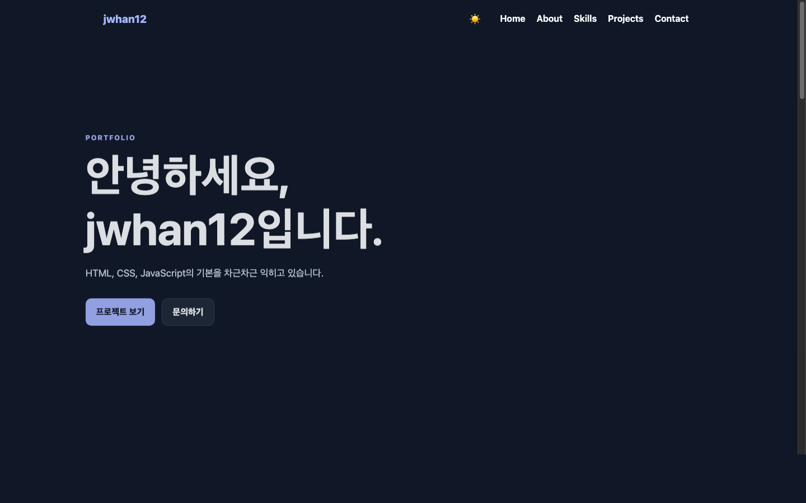

# 나를 소개하는 웹사이트 처음부터 만들기

순수 HTML, CSS, JavaScript로 만든 반응형 포트폴리오 웹사이트입니다.  
사용자 이벤트 → 상태 변경 → 화면 업데이트 흐름을 쉽게 확인할 수 있게 작성했습니다.

## 배포 URL

GitHub Pages를 `main` 브랜치의 `/ (root)`로 설정하면 아래 주소에서 확인할 수 있습니다.

- https://jwhan12.github.io/b1-1/

### GitHub Pages 배포 방법

1. 변경 사항을 GitHub의 `main` 브랜치에 반영합니다.
2. GitHub 저장소에서 `Settings` → `Pages`로 이동합니다.
3. `Build and deployment`의 `Source`에서 `Deploy from a branch`를 선택합니다.
4. 배포 브랜치를 `main`, 폴더를 `/ (root)`로 지정한 뒤 `Save`를 누릅니다.
5. 배포가 완료되면 위 배포 URL에서 사이트를 확인합니다.

> 자세한 내용은 [GitHub 공식 문서](https://docs.github.com/en/pages/getting-started-with-github-pages/configuring-a-publishing-source-for-your-github-pages-site)를 참고하세요.

## 사용 기술과 기능

- HTML: 시맨틱 태그와 접근 가능한 폼 레이블
- CSS: 변수, Flexbox, Grid, 768px·1024px 반응형 미디어 쿼리
- JavaScript: DOM 선택, 이벤트, 상태, `fetch`, `async/await`
- 햄버거 메뉴, 부드러운 스크롤, 다크 모드, 스크롤 탑 버튼
- 스크롤 60px에서 헤더 변경, 300px에서 탑 버튼 표시
- GitHub API 프로젝트 목록 및 로딩·성공·에러·빈 상태
- `IntersectionObserver` threshold 0.2 기반 섹션 애니메이션

## 실행 방법

1. [Visual Studio Code](https://code.visualstudio.com/)에서 프로젝트 폴더를 엽니다.
2. Extensions에서 **Live Server** 확장을 검색해 설치합니다.
3. `index.html`을 열고 에디터에서 마우스 오른쪽 버튼을 누른 뒤 **Open with Live Server**를 선택합니다.
4. 브라우저에서 열린 페이지를 확인합니다. 파일을 저장하면 변경 사항이 실시간으로 반영됩니다.

기본 설정에서는 `http://127.0.0.1:5500` 주소로 실행됩니다.

## 폴더 구조

```text
b1-1/
├── css/style.css
├── images/profile.svg
├── images/screenshots/
├── js/main.js
└── index.html
```

## 화면

### 데스크톱



### 모바일



### 다크 모드


